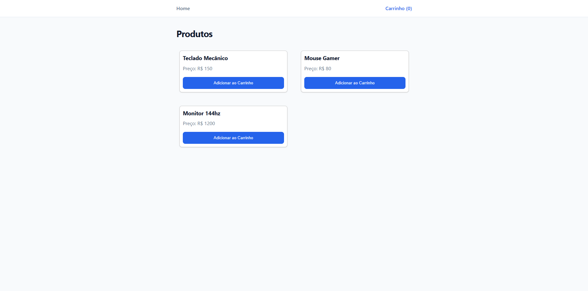

# Pure Mart

> A high-performance, framework-less Single Page Application (SPA) e-commerce built from scratch with Vanilla TypeScript.

 
## About The Project

In an era dominated by frameworks like React, Vue, and Angular, it's easy to forget how the web actually works under the hood.

**Pure Mart** is not just an e-commerce POC; it's a deep dive into Software Engineering fundamentals. The goal was to rebuild the core features of modern frontend frameworks—state management, routing, and component lifecycle—using only native Web APIs and Design Patterns in TypeScript.

By "reinventing the wheel," I gained a profound appreciation for the abstractions React provides and a deeper understanding of the DOM, browser performance, and architectural patterns.

## Key Engineering Features

This project implements complex architectural patterns manually, without external libraries:

* **Custom Reactive State Management:** Implemented a global store using the **Observer Pattern** (Pub/Sub). Components subscribe to state changes and update granularly, similar to how Redux or Context API works internally.
* **Client-Side SPA Routing:** Intercepts browser navigation using the **History API** (`pushState`) to render different views dynamically without triggering full page reloads.
* **Component-Based Architecture:** Utilizes TypeScript **abstract classes** and **inheritance** to create reusable base components with lifecycle methods simulation (like `mount` and `render`).
* **Performance-First DOM Manipulation:** Focuses on efficient DOM updates (using modern APIs like `replaceChildren` and `insertAdjacentHTML`) to minimize reflows and repaints.

## Tech Stack

* **Core:** TypeScript (Strict Mode)
* **Build Tool:** Vite
* **Styling:** CSS Variables & CSS Grid (No CSS frameworks)
* **Dependencies:** Zero runtime dependencies.

## Getting Started

### Prerequisites

* Node.js (v16 or higher)

### Installation

1.  Clone the repository:
    ```bash
    git clone https://github.com/AiltonFilho26/pure-mart.git
    ```
2.  Install dependencies:
    ```bash
    npm install
    ```
3.  Start the development server:
    ```bash
    npm run dev
    ```
4.  Build for production:
    ```bash
    npm run build
    ```

## Lessons Learned & Challenges

Building this project highlighted the complexity hidden by modern tools:

1.  **State Synchronization:** Manually ensuring the UI (Header, Cart) reflects the state without causing infinite loops or stale data is challenging.
2.  **DOM Performance:** Understanding the cost of `innerHTML = ""` versus surgical updates was crucial for maintaining performance.
3.  **Event Listener Management:** Preventing memory leaks by correctly attaching and considering detachment strategies for event listeners in a SPA environment.

---


Made with 💙 and lots of `console.log` by Ailton Teixeira.
